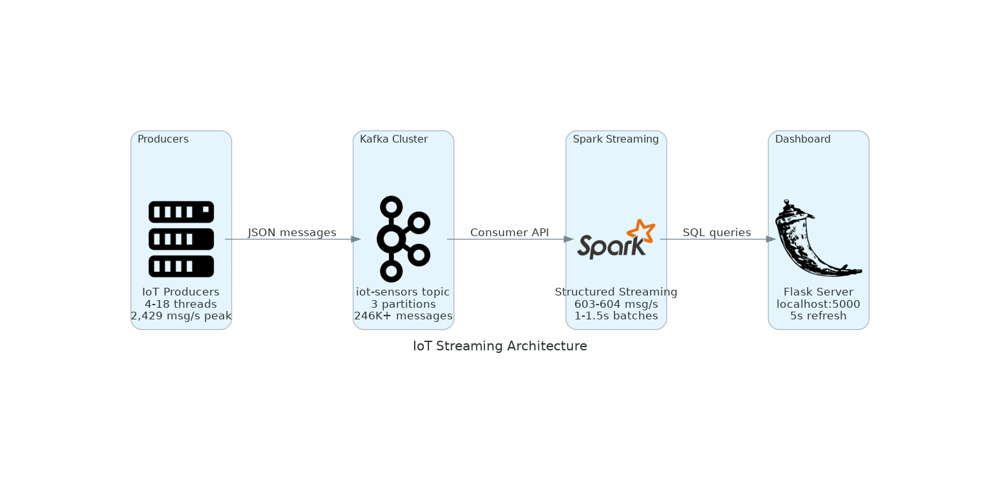

# IoT Streaming Application with Kafka and Spark

Real-time IoT sensor monitoring system using Apache Kafka and Spark Structured Streaming with Flask dashboard.

## Quick Start

### Prerequisites

- Ubuntu 20.04+ / macOS / Windows with WSL2
- Java 11 or 17
- Python 3.8+
- 8GB+ RAM

### Installation
```bash
# 1. Install Kafka
wget https://downloads.apache.org/kafka/3.9.0/kafka_2.13-3.9.0.tgz
tar -xzf kafka_2.13-3.9.0.tgz
sudo mv kafka_2.13-3.9.0 /opt/kafka
export KAFKA_HOME=/opt/kafka/kafka_2.13-3.9.0
export PATH=$PATH:$KAFKA_HOME/bin

# 2. Set Java Home
export JAVA_HOME=/usr/lib/jvm/java-17-openjdk-amd64  # Adjust path

# 3. Install Python packages
python3 -m venv spark_env
source spark_env/bin/activate
pip install pyspark==3.5.0 kafka-python==2.0.2 flask==2.3.2 plotly==5.14.1
```

### Start Services
```bash
# Start Zookeeper
$KAFKA_HOME/bin/zookeeper-server-start.sh -daemon $KAFKA_HOME/config/zookeeper.properties
sleep 5

# Start Kafka
$KAFKA_HOME/bin/kafka-server-start.sh -daemon $KAFKA_HOME/config/server.properties
sleep 5

# Create topic
$KAFKA_HOME/bin/kafka-topics.sh --create \
  --topic iot-sensors \
  --bootstrap-server localhost:9092 \
  --partitions 3 \
  --replication-factor 1
```

## Running the Application

### Part 1: Basic Producer-Consumer
```bash
# Terminal 1 - Producer
source spark_env/bin/activate
python iot_producer.py

# Terminal 2 - Consumer
source spark_env/bin/activate
python iot_consumer.py
```

### Part 2: Spark Streaming
```bash
# Terminal 1 - Producer
python iot_producer.py

# Terminal 2 - Spark Streaming
python structured_streaming_processor.py

# View Spark UI: http://localhost:4040
```

### Part 3: Dashboard (Main Application)
```bash
# Terminal 1 - Producer
python iot_producer.py

# Terminal 2 - Dashboard
rm -rf /tmp/dashboard-*-checkpoint  # Clean checkpoints
python iot_streaming_app.py

# View Dashboard: http://localhost:5000
```

### Part 4: Performance Testing
```bash
# Terminal 1 - Dashboard (keep running)
python iot_streaming_app.py

# Terminal 2 - Performance Tests
python performance_test.py
# Select test: 1 (Burst), 2 (High Volume), 3 (Stress), 4 (Sustained), 5 (Custom)
```

# Architecture



**Components:**
- **Kafka Topic**: `iot-sensors` with 3 partitions
- **Spark Streaming**: 30s windows, 10s slides, 5s watermark
- **Dashboard**: Real-time metrics at localhost:5000, 5s refresh
- **Checkpoints**: `/tmp/dashboard-sensors-checkpoint`, `/tmp/dashboard-alerts-checkpoint`

## Performance Results

| Test | Messages | Threads | Throughput | Latency | Success Rate |
|------|----------|---------|------------|---------|--------------|
| Burst | 1,000 | 4 | 1,100 msg/s | 3.42 ms | 100% |
| High Volume | 10,000 | 8 | 1,682 msg/s | 4.59 ms | 100% |
| Stress | 50,000 | 16 | 2,267 msg/s | 6.90 ms | 100% |
| Sustained | 4,851 | Rate-limited | 81 msg/s | 2.15 ms | 100% |
| **Custom (Optimal)** | **99,990** | **18** | **2,429 msg/s** | **7.25 ms** | **100%** |

**Key Finding:** 18 threads (6 per partition) achieved best performance with 7.29 msg/s per 1% CPU.

## Monitoring
```bash
# Spark UI
http://localhost:4040

# Dashboard
http://localhost:5000

# Kafka topic info
$KAFKA_HOME/bin/kafka-topics.sh --describe --topic iot-sensors --bootstrap-server localhost:9092

# Consumer groups
$KAFKA_HOME/bin/kafka-consumer-groups.sh --bootstrap-server localhost:9092 --describe --all-groups

# System resources
htop
```

## Troubleshooting

**Checkpoint error:**
```bash
rm -rf /tmp/dashboard-*-checkpoint
rm -rf /tmp/spark-*-checkpoint
```

**Scala version error:**
Edit `iot_streaming_app.py` and `structured_streaming_processor.py`:
```python
.config("spark.jars.packages", "org.apache.spark:spark-sql-kafka-0-10_2.13:3.5.0")
```

**Kafka not responding:**
```bash
pkill -f kafka
pkill -f zookeeper
# Then restart services
```

**Dashboard shows zeros:**
Ensure producer is running and Spark streaming queries are active (check terminal output).

## File Structure
```
├── iot_producer.py                    # Multi-threaded sensor simulator
├── iot_consumer.py                    # Consumer with alerts
├── structured_streaming_processor.py  # Windowed aggregations
├── iot_streaming_app.py              # Main dashboard application
├── performance_test.py               # Load testing (5 scenarios)
└── README.md                         # This file
```

## API Endpoints
```bash
# Get metrics
curl http://localhost:5000/api/metrics

# Get alerts
curl http://localhost:5000/api/alerts
```

## Notes

- **Consumer Groups**: Spark uses checkpoint-based offset management, not traditional consumer groups
- **Late Data**: Within 5s watermark, late data is included in subsequent batches
- **Memory**: Consistently stays below 11% usage across all tests
- **Optimal Config**: 18 threads = 6 threads per partition for best performance

## Author
- **Name**: Salma Elsayed Khalil
- **SID**: 900213357
